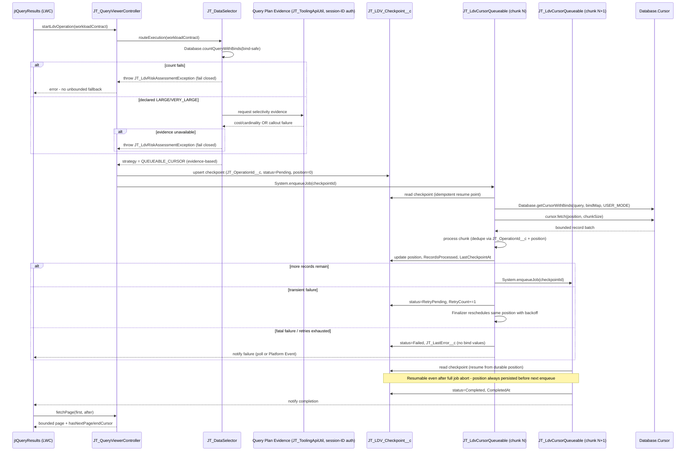

# ADR-001: Bounded, Resumable Large-Data-Volume (LDV) Processing

**Author:** Salesforce Servicios Profesionales
**Version:** 1.7
**Status:** Proposed — awaiting developer sign-off before implementation
**Related:** GitHub Issue #43
**API Version Target:** 67.0 (per `sfdx-project.json` → `sourceApiVersion`)

---

## Context

`JT_DynamicQueries` advertises cursor/batch processing for large result sets, but the
current implementation does not bound Apex heap, browser heap, or transaction count. This
was confirmed by direct code inspection against commit `2c85d34`:

1. **`JT_DataSelector.processRecordsWithCursor`** (lines ~997–1040) calls
   `Database.queryWithBinds(...)`, assigns the full result to `allRecords`, and only _then_
   slices it into batches with a for-loop. It never calls `Database.getCursorWithBinds` or
   `Cursor.fetch(position, count)` despite the ApexDoc claiming
   `"Process large query results using Apex Cursors (Beta)"`. There is no bound on
   `allRecords`; a query returning 500K rows is materialized in a single transaction before
   any "batching" happens.

2. **`JT_QueryViewerController.executeQueryWithBatchProcessing`** (lines ~1611–1670+) drives
   `processRecordsWithCursor` through a `ResultCollector` (`CursorProcessor`) that
   accumulates every batch into one list, then serializes/deserializes the _entire_ result
   with `JSON.serialize` / `JSON.deserializeUntyped` before returning it to the client in one
   `QueryResult`. The "batch processing" label is misleading — the client still receives one
   unbounded payload.

3. **`JT_DataSelector.getRecordsWithAutoStrategy`** (lines ~1512–1600) routes on an exact
   record-count threshold (`effectiveThreshold`, default 50,000) from `countRecordsInternal`.
   Confirmed **fail-open** behavior at lines 1540–1549:

   ```apex
   try {
     recordCount = countRecordsInternal(config.JT_BaseQuery__c, mergedBindings, enforceSecurity);
   } catch (Exception e) {
     // If COUNT fails, fall back to standard query
     return getRecords(devName, enforceSecurity, mergedBindings);
   }
   ```

   Any COUNT failure — including a governor-limit or query-plan-cost error that is itself
   evidence of an expensive/unselective query — silently degrades to the **unbounded**
   `getRecords()` path. This is the opposite of what an LDV guard should do.

4. **`countRecordsInternal`** (lines ~1420–1500) converts arbitrary SOQL to a COUNT query via
   regex (`SELECT[\s\S]+?FROM` → `SELECT COUNT() FROM`, then strips `ORDER BY` / `LIMIT` /
   `OFFSET` with further regex), then — because `Database.countQuery` does not accept a bind
   map — **interpolates bind values as literals into the query string** (lines 1459–1497:
   string-escaping branches for `String`, `Date`, `Datetime`, `Boolean`/`Integer`/`Decimal`,
   `List<Object>`). This is a hand-rolled literal-injection path parallel to, but distinct
   from, the parameterized `Database.queryWithBinds` path used elsewhere — a second place
   where query text must be trusted to be safely escaped.

5b. **Client-side mirror of the fail-open bug**, confirmed in
`force-app/main/default/lwc/jtQueryViewer/jtQueryViewer.js:2839-2846`
(`assessQueryRiskAndExecute`):

```js
.catch(() => {
  // If assessment fails, proceed with caution (execute normally)
  this.executeQueryNormal();
});
```

This is the same defect as item 3 (fail-open on COUNT/risk failure), duplicated in the
presentation layer: if `assessQueryRisk` throws, the LWC does not surface an error — it
silently runs the **unbounded** `executeQueryNormal()` path anyway. A fail-closed
Apex contract (§4) is not sufficient by itself; this `.catch` must also change to
show a blocking error state, or the client reintroduces the exact bug the backend fix
removes.

5. **`JT_QueryViewerController.assessQueryRisk`** (lines ~538–750) treats "has `WHERE` clause
   - non-empty bindings" as evidence of low/medium risk whenever the real COUNT query fails,
     e.g. (lines 656–662, and again 702–711):

   ```apex
   if (hasWhereClause && hasValidBindings) {
     estimatedCount = 10000; // Medium risk threshold
   } else {
     estimatedCount = 99999; // Critical risk
   }
   ```

   Presence of a bound `WHERE` clause is not evidence of _selectivity_ (a bound filter on a
   low-cardinality index-less field can still return millions of rows). Additionally, line
   686 (`System.debug(LoggingLevel.WARN, 'COUNT bindings that failed: ' + JSON.serialize(countBindings))`)
   logs raw bind values — including whatever end-user input populated them — to debug logs.
   This is an existing, concrete instance of the "remove sensitive query/bind values from
   logs/telemetry" gap called out in the issue, not merely a theoretical risk.

6. **`jtQueryResults.js`** paginates entirely client-side: `_records` holds the full result
   set, and `paginatedResults` (lines ~290–298) does `this._records.slice(start, end)`. JSON
   and CSV export operate on the same fully-retained in-memory collection. By the time
   pagination happens, both the Apex heap and the browser heap have already absorbed the
   complete result.

7. **No existing checkpoint/job-state object.** The closest architectural precedent is
   `JT_RunAsTest_Execution__c`, which already tracks an async operation's identity and
   progress with fields such as `Apex_Queueable_Job_Id__c`, `Test_Status__c`,
   `Initiated_By__c`, `Execution_Time__c`, `Error_Message__c`, and `Bindings_Json__c`. No
   object exists for cursor position, retry count, or chunk-level processing metrics.

8. **Existing async precedent** in this codebase: `JT_UsageFinderQueueable` (`with sharing`
   `Queueable`, single-shot, Platform-Cache-backed results, no chaining, no checkpoint),
   `JT_RunAsTestEnqueuer` (`without sharing` `Queueable, Database.AllowsCallouts`, Tooling API
   driven), and `JT_MetadataDeployCallback` (`Metadata.DeployCallback`, event-driven, no
   sharing declared). None of these chain jobs or persist a resumable position — this
   project has no existing multi-transaction resumable pattern to copy; this ADR proposes
   the first one.

This is a **workaround-first** design problem: the "cursor" and "batch" claims in the code
and docs are currently untrue, and the auto-routing logic actively defeats the LDV
protection it claims to provide by failing open. Fixing this touches 2+ custom
objects (new checkpoint object + existing `JT_DynamicQueryConfiguration__mdt` reads) and
3+ metadata types (Apex classes, a new custom object, LWC, Custom Metadata Type usage),
which is why this ADR and diagram are required before any implementation PR per this
repo's Design-Before-Code gate.

---

## Decision

### 1. Async chunking boundary: chained Queueable driving an explicit `Database.Cursor`

We will introduce a new orchestrator, tentatively `JT_LdvCursorQueueable`, that:

- Opens (or resumes) an Apex `Database.Cursor` via `Database.getCursorWithBinds(query,
bindMap, accessLevel)` — the actual Cursor API the current ApexDoc falsely claims to use.
- Fetches one bounded chunk per invocation: `cursor.fetch(position, chunkSize)`.
- Persists `position`, `status`, `retryCount`, and metrics to a new checkpoint record
  (see §2) **before** re-enqueueing the next chunk, so the durable position is always
  ahead of in-memory state, not behind it.
- Re-enqueues itself (`System.enqueueJob`) with the checkpoint's record ID as the only
  required constructor argument, so each chunk is a fresh, independently-bounded
  transaction — no `CursorProcessor` instance is carried across transactions (it isn't
  serializable, which is exactly why `processRecordsWithCursor` currently _has_ to hold
  everything in one transaction today).
- Uses `System.attachFinalizer` on each chunk to implement bounded retry with backoff:
  on transient failure, the Finalizer re-enqueues the same checkpoint position (not
  `position + chunkSize`) up to `JT_LDV_Checkpoint__c.JT_MaxRetries__c`; on fatal failure or
  retry exhaustion, it flips status to `Failed` and stops the chain (fail closed).

#### Options considered

| Option                                                      | Pros                                                                                                                                                                                                                                                                                                                                                                                                                                                                                                                                    | Cons                                                                                                                                                                                                                                                                                                                                                                                                                                                                                                                                                                                                                                                                              |
| ----------------------------------------------------------- | --------------------------------------------------------------------------------------------------------------------------------------------------------------------------------------------------------------------------------------------------------------------------------------------------------------------------------------------------------------------------------------------------------------------------------------------------------------------------------------------------------------------------------------- | --------------------------------------------------------------------------------------------------------------------------------------------------------------------------------------------------------------------------------------------------------------------------------------------------------------------------------------------------------------------------------------------------------------------------------------------------------------------------------------------------------------------------------------------------------------------------------------------------------------------------------------------------------------------------------- |
| **Chained Queueable + explicit `Database.Cursor`** (chosen) | Matches issue's explicit ask; `Database.getCursorWithBinds` accepts a bind **map** directly — no literal interpolation needed, unlike `Database.countQuery`; full control over checkpoint read/write timing, retry policy, and idempotency; `System.Finalizer` gives a native, documented retry/backoff hook (available since Summer '21, well within API 65.0); matches this codebase's existing `Queueable`-first async precedent (`JT_UsageFinderQueueable`, `JT_RunAsTestEnqueuer`) so the team already has operational familiarity | Must hand-roll the position/backoff bookkeeping that Batch Apex gives for free within a single job; org-wide Flex Queue holds a max of 100 queued jobs at rest, so many concurrent LDV operations across users must be capacity-planned (not a per-operation limit, but a shared org resource); only one job may be chained from within an executing Queueable (no problem here since we chain exactly one next-chunk job per execution)                                                                                                                                                                                                                                          |
| **Batch Apex** (`Database.Batchable`)                       | Native chunking, automatic scope-sized `execute()` per transaction, well-understood LDV tool, Apex Jobs UI visibility for free                                                                                                                                                                                                                                                                                                                                                                                                          | `start()` returns a `QueryLocator` or `Iterable<SObject>` — **neither accepts a bind map**. A `QueryLocator` built from a dynamic query string re-introduces exactly the literal-interpolation problem the issue wants removed from `countRecordsInternal`; an `Iterable<SObject>` could wrap a hand-written iterator around `Database.Cursor`, but then Batch Apex's own internal chunking is redundant with the Cursor's own bounded fetch, and a **whole-job failure is not resumable from the last successful chunk** without you building the same checkpoint machinery anyway — at which point Batch Apex adds ceremony without solving the bind-safety or resumability gap |
| **Platform Events + Queueable**                             | Decouples trigger from execution; could fan out to multiple consumers                                                                                                                                                                                                                                                                                                                                                                                                                                                                   | No precedent in this codebase; introduces event-bus governor limits, at-least-once/duplicate delivery semantics that complicate the idempotency requirement, and added latency for a purely internal chunk-to-chunk handoff that has no legitimate multi-subscriber use case here                                                                                                                                                                                                                                                                                                                                                                                                 |

**Chosen: chained Queueable + explicit `Database.Cursor`.** It is the only option that
satisfies "actual Cursor API usage," "bind-safe" (no literal interpolation), and
"resumable after a fatal job abort" simultaneously, and it extends a pattern this
codebase already uses rather than introducing a new async paradigm.

### 2. Checkpoint persistence: new `JT_LDV_Checkpoint__c` custom object

Modeled directly on `JT_RunAsTest_Execution__c`'s async-tracking pattern, adapted for
resumable cursor state:

| Field (API name)                                                   | Type                                                                                       | Purpose                                                                                                                                                                                |
| ------------------------------------------------------------------ | ------------------------------------------------------------------------------------------ | -------------------------------------------------------------------------------------------------------------------------------------------------------------------------------------- |
| `JT_OperationId__c`                                                | Text(36), External ID, Unique                                                              | Idempotency key for the whole LDV operation; caller-supplied or generated once at operation start                                                                                      |
| `JT_ConfigDevName__c`                                              | Text(255)                                                                                  | `JT_DynamicQueryConfiguration__mdt.DeveloperName` being executed                                                                                                                       |
| `JT_BindingsJson__c`                                               | Long Text Area, **plain — no Shield Platform Encryption dependency (see rationale below)** | Serialized bind map needed to resume the cursor; access-restricted via OWD/FLS, never written to debug logs (see §4)                                                                   |
| `JT_CursorPosition__c`                                             | Number(18,0)                                                                               | Next `Cursor.fetch(position, ...)` offset                                                                                                                                              |
| `JT_ChunkSize__c`                                                  | Number(18,0)                                                                               | Bounded fetch size for this operation                                                                                                                                                  |
| `JT_Status__c`                                                     | Picklist: `Pending, InProgress, RetryPending, Completed, Failed, Aborted`                  | Mirrors `JT_RunAsTest_Execution__c.Test_Status__c` pattern                                                                                                                             |
| `JT_RetryCount__c`                                                 | Number(18,0)                                                                               | Current transient-retry attempts                                                                                                                                                       |
| `JT_MaxRetries__c`                                                 | Number(18,0)                                                                               | Bound for retry/backoff                                                                                                                                                                |
| `JT_LastError__c`                                                  | Long Text Area                                                                             | Error message/type only — never bind values                                                                                                                                            |
| `JT_RecordsProcessed__c`                                           | Number(18,0)                                                                               | Cumulative processing metric                                                                                                                                                           |
| `JT_TotalRecordCount__c`                                           | Number(18,0)                                                                               | From the workload contract's count/risk evidence, if available                                                                                                                         |
| `JT_QueueableJobId__c`                                             | Text(18)                                                                                   | Mirrors `JT_RunAsTest_Execution__c.Apex_Queueable_Job_Id__c`; last enqueued `AsyncApexJob` Id for observability                                                                        |
| `JT_ProcessorClass__c`                                             | Text(255)                                                                                  | Fully-qualified `CursorProcessor` implementation type name to re-instantiate on resume (instances aren't serializable across transactions, so we persist the _type_, not the instance) |
| `JT_StartedAt__c` / `JT_LastCheckpointAt__c` / `JT_CompletedAt__c` | DateTime                                                                                   | Timestamps for observability and stale-operation detection                                                                                                                             |
| `JT_InitiatedBy__c`                                                | Lookup(User)                                                                               | Mirrors `JT_RunAsTest_Execution__c.Initiated_By__c`                                                                                                                                    |

`JT_OperationId__c` as an External ID/Unique field is what makes chunk processing
idempotent and replay-safe: a retried or duplicated chunk enqueue for the same operation
resolves to the same checkpoint row via `Database.upsert`, so re-processing never
double-advances `JT_CursorPosition__c`.

**`JT_BindingsJson__c` is deliberately not Shield-encrypted.** An earlier version of this
ADR proposed Shield Platform Encryption on this field. **Confirmed with developer:**
rejected — this is a managed package intended for broad AppExchange distribution, and
Shield is a paid add-on most subscriber orgs will not have licensed. Making core
resumability depend on it would either fail to deploy for non-Shield orgs or silently
degrade, neither acceptable for a package-wide feature. The compensating control instead
is access security, not platform encryption: `JT_LDV_Checkpoint__c` ships with a
restrictive OWD (Private) and `JT_BindingsJson__c` FLS granted only to an
admin/integration Permission Set — never exposed via LWC or any public-facing API. This
is orthogonal to, and fully satisfies, the issue's "never log bind values" requirement
(§4), independent of encryption. Customers who need field-level encryption for their own
compliance can enable Shield on this field themselves post-install; the package neither
requires nor blocks it.

### 3. Explicit workload contract replacing count-only auto-routing

Add a caller-declared `JT_WorkloadContract` input (analogous to `AutoStrategyParams`, but
mandatory and validated rather than inferred):

```apex
public class JT_WorkloadContract {
  public JT_UseCase useCase; // enum: INTERACTIVE_UI, EXPORT, INTEGRATION_BULK
  public JT_ExpectedVolume expectedVolume; // enum: SMALL, MEDIUM, LARGE, VERY_LARGE
  public Boolean requiresMultiTxn; // true => must use Queueable/Cursor path, never sync
  public Boolean hasSideEffects; // true => idempotency key mandatory, retries must be safe
  public Boolean mustBeRecoverable; // true => checkpoint required even for MEDIUM volume
}
```

Routing becomes: validate the declared contract against **independent evidence**
(record count via `Database.countQueryWithBinds` — see §4 — and, for `LARGE`/`VERY_LARGE`
declarations, selectivity evidence), then select `SYNC_STANDARD`, `QUEUEABLE_CURSOR`, or
`BATCH_APEX` explicitly. The contract's declared volume and the evidence must agree within
a tolerance; a mismatch (e.g., caller declares `SMALL` but evidence shows `VERY_LARGE`) is
itself a fail-closed condition, not a silent override in either direction.

### 4. Fail-closed count/risk gating with a bind-safe count contract

- Replace the `try { countRecordsInternal(...) } catch { return getRecords(...) }` pattern
  with a typed exception (e.g., `JT_LdvRiskAssessmentException`) that the caller must
  handle explicitly. No code path may fall through to `getRecords()` on a COUNT/risk
  failure.
- Replace the regex-rewrite-then-literal-interpolate implementation of
  `countRecordsInternal` with `Database.countQueryWithBinds(countQuery, bindMap,
accessLevel)` (available since Spring '23 / API 57.0, safely within this project's API
  65.0 floor). This removes the entire literal-escaping block (lines 1459–1497) — the bind
  map is passed directly, the same way `Database.queryWithBinds` already works elsewhere
  in this class, so there is exactly one bind-safety pattern in the codebase instead of two.
- `assessQueryRisk`'s `hasWhereClause && hasValidBindings ⇒ lower risk` heuristic is
  replaced by real selectivity evidence (§5) wherever the workload contract declares
  `LARGE`/`VERY_LARGE` or `mustBeRecoverable = true`. The heuristic may remain only as a
  last-resort _documented_ fallback classification for `SMALL`/interactive paths where a
  human reviews the result immediately, and it must never silently promote to "safe."
- Remove `System.debug(... JSON.serialize(countBindings) ...)` and any other logging of
  bind values; log query _shape_ (dev name, config, redacted parameter names) only.

### 5. Selectivity evidence, independent of record count

Apex has no native "get me the query plan" method; the only platform-provided source is
the REST/Tooling API `/query/explain` endpoint, reachable only via HTTP callout.

**No new Named Credential.** This codebase already makes Tooling API callouts —
`JT_ToolingApiUtil.executeToolingApiQuery`/`createToolingApiRestRequest`, consumed by
`JT_UsageFinder`/`JT_UsageFinderQueueable` and the ApexLog-body fetch — and none of them
use a Named Credential today. They call `URL.getOrgDomainUrl()` directly and authenticate
with `Authorization: Bearer <sessionId>`, where the session ID comes from a
`PageReference` to `Page.JT_SessionIdPage` (cached in a static var + `Cache.Org` for 5
minutes). Every one of those methods carries
`@SuppressWarnings('PMD.ApexSuggestUsingNamedCred')`, i.e. the PMD rule this repo's own
Architect Standard is based on ("integrations: always require Named Credentials") is
already deliberately overridden project-wide for Tooling API.

This is not an oversight: a Named Credential for this _was_ built —
`force-app/main/default/namedCredentials/JT_Tooling_API.namedCredential-meta.xml.backup`
(`protocol=NoAuthentication`, endpoint `{!$Credential.JT_Tooling_API}`) — plus deploy-time
scripts (`deploy-with-replacement.sh`, `setup-org-url.sh`, per `CHANGELOG.md`) that
string-replaced the org-specific endpoint before each deploy. It was abandoned: the
`.backup` extension excludes it from SFDX deployment, and no Apex references
`callout:JT_Tooling_API` anymore. The most likely reason (not confirmed with the original
author, flagged as an open question below) is packaging — a managed package headed for
AppExchange cannot ship a Named Credential that requires a manual, org-specific
deploy-time replacement step; the session-ID-via-VF-page approach needs no post-install
configuration.

**Decision: extend `JT_ToolingApiUtil` with the `/query/explain` call, using the exact
same session-ID pattern already in production for every other Tooling API call in this
codebase.** No new Named Credential, no new deploy script, no new manual setup step.
This is invoked only for `LARGE`/`VERY_LARGE`-declared workloads (not on every
keystroke/interactive query), with results cached in Platform Cache for a short TTL keyed
by config dev name + binding shape. See "Complications" below for why this deviates from
the letter of the Architect Standard.

**Confirmed with developer:** Option A (reuse `JT_ToolingApiUtil`) is the chosen path.
A `System.InstallHandler`-driven self-configuring Named Credential (auto-provisioning the
endpoint via `Metadata.Operations.enqueueDeployment` at install/upgrade, avoiding the
manual-script problem that killed the original NC attempt) was evaluated as an
alternative that would satisfy the standard literally, but was explicitly declined in
favor of Option A to avoid adding a new `InstallHandler` class, live NC metadata, and
install-time deployment test coverage to an already large, 6-sub-PR issue. Revisit if a
future integration needs a proper Named Credential anyway — at that point the
InstallHandler cost is shared, not incremental.

### 6. GraphQL-style forward pagination and streaming export (contract only, this ADR)

`JT_QueryViewerController` gains a paginated contract — `{ first, after, hasNextPage,
endCursor }` — backed by the same checkpoint/cursor infrastructure, so `jtQueryResults`
requests one bounded page at a time instead of slicing an already-fully-loaded
`_records` array. CSV/JSON export is re-implemented to stream page-by-page (reusing the
same forward-pagination contract) rather than serializing one in-memory collection. Full
interface design is deferred to sub-PR 4/5 (see Consequences) — this ADR fixes the shape
of the contract, not its final field-level implementation.

### 7. UI impact (confirmed against current `jtQueryViewer`/`jtQueryResults`)

The current LWC layer has no concept of a long-running/async operation at all —
`executeQueryWithBatches()` (`jtQueryViewer.js:2900`) already awaits one `.then()` with
the **entire** result materialized, confirming the ADR's core claim reaches all the way
to the client. This ADR's decisions require new UI states, not just backend changes:

- **New "operation in progress" state.** For `QUEUEABLE_CURSOR`-routed executions, the
  controller can no longer return a complete result in one round trip. The LWC needs
  polling (or a Platform Event subscription) against the checkpoint's
  `JT_Status__c`/`JT_RecordsProcessed__c`/`JT_TotalRecordCount__c`, a real progress
  indicator, and a working Cancel action — today `handleCancelExecution()` only dismisses
  the risk modal; there is nothing to cancel because everything is synchronous.
- **New blocking-error state for fail-closed gating.** Once §4/§5b land, both
  `assessQueryRisk` failures and count/risk-assessment exceptions must show a blocking
  error instead of silently degrading to unbounded execution (see item 5b above).
- **Pagination — low impact.** `jtQueryResults` today only exposes Previous/Next +
  "Page X of Y" (`jtQueryResults.html:277-304`), no arbitrary page jump. Forward-only
  `{first, after, hasNextPage, endCursor}` maps directly onto "Next"; "Previous" is
  recovered by keeping a client-side stack of visited `endCursor` values — no backend
  contract change needed for that. The total-count display is unaffected since
  `Database.countQueryWithBinds` still runs up front.
- **Export — from instant download to background-generate-then-notify.** Streaming
  CSV/JSON export can no longer build the file from an in-memory array on click; large
  exports need the same progress/notify pattern as query execution, not a new pattern.
- **Setup Wizard.** New step/banner recommending the admin schedule
  `JT_LdvCheckpointPurgeBatch` (per the retention decision above).

Sub-PRs 2–5 must include these UI states in their definition of done — a backend-only
implementation of chained Queueables or forward pagination without the corresponding LWC
states would leave the UI either broken (awaiting a response that never synchronously
arrives) or silently reverting to today's fail-open behavior.

---

### Sequence diagram



---

## Consequences

### Positive

- No LDV path materializes a full result set in Apex or browser memory (acceptance
  criterion 1).
- Real `Database.Cursor` usage with bounded `fetch()`, satisfying criterion 2, and making
  the ApexDoc/README claims true instead of aspirational.
- Idempotent, checkpointed chunks are retryable and resumable across job aborts
  (criterion 3).
- Explicit, evidence-validated strategy selection replaces exact-threshold guessing
  (criterion 4).
- Count/risk failures are typed exceptions the caller must handle — no silent unbounded
  fallback (criterion 5).
- Single bind-safe pattern (`Database.queryWithBinds` / `Database.countQueryWithBinds`)
  across read and count paths — the literal-interpolation code is deleted, not just
  hidden.

### Negative / costs

- New custom object (`JT_LDV_Checkpoint__c`) adds a metadata type and its own CRUD/FLS,
  sharing, and retention/purge story. **Confirmed with developer:** purge is a
  `JT_LdvCheckpointPurgeBatch` (`Database.Batchable<SObject>, Schedulable`) that hard-`DELETE`s
  `Completed`/`Failed` rows older than a configurable threshold (default 30 days, exposed
  as a new field on the existing `JT_DynamicQuerySettings__c`/`JT_SystemSettings__mdt`
  settings surface rather than hardcoded). Scheduling it is a **manual admin step, not
  auto-scheduled via `InstallHandler`** — consistent with keeping install-time automation
  out of scope for this issue (same call as the Named Credential decision in §5). This
  must be explicitly documented (not just mentioned in passing) in `CONTRIBUTING.md`'s
  setup section and surfaced as a recommended next step in the existing
  `JT_SetupWizardController`/Setup Wizard UI, since an undocumented manual step is the
  same failure mode that produced the original Named Credential's abandoned deploy
  script — the checkpoint table will grow unbounded for any admin who never sees the
  instruction. Sub-PR 1 (checkpoint object) must ship this documentation, not defer it.
- `JT_BindingsJson__c` must persist enough of the bind map to resume a query, which is in
  tension with "remove sensitive values from logs." Resolved via access security (Private
  OWD + admin/integration-only FLS), not platform encryption — see §2 rationale. This
  avoids a Shield licensing dependency but means bind values sit in plaintext at rest,
  protected only by object/field-level access control, not encryption-at-rest; acceptable
  because the checkpoint object is never exposed to end users or public APIs, but worth
  re-confirming if a future customer's compliance requirements demand encryption-at-rest
  regardless of exposure surface — in that case, they can layer Shield on this field
  themselves post-install.
- Query Plan evidence requires a callout to `/query/explain` via `JT_ToolingApiUtil`
  (session-ID auth, no Named Credential), which is unavailable in fully offline/unit-test
  contexts and adds latency + an external dependency to the risk-gating path. Mitigated by
  caching evidence in Platform Cache and only invoking it for `LARGE`/`VERY_LARGE`-declared
  workloads, not every query. Reusing `JT_ToolingApiUtil` also means this call inherits its
  existing failure modes: it depends on `Page.JT_SessionIdPage` being deployed/accessible,
  and on the calling user having Tooling API access — both already true today for
  `JT_UsageFinder`, so this adds no new deployment prerequisite, but does mean the
  risk-gating path is only as reliable as that existing session-ID mechanism.
- Chained Queueable jobs share the org-wide Flex Queue (100 queued jobs at rest); this is
  an org capacity-planning concern under concurrent LDV load, not a defect of the design,
  but must be documented and monitored.

### Complications found during investigation (things that make the issue's ask harder than it reads)

- **Live verification of `JT_LDV_Checkpoint__c`'s non-required fields is currently blocked by
  a platform inconsistency, unrelated to this ADR's design.** Deploying the object's
  non-required custom fields consistently reports `created=true` from the Metadata API across
  three independently-tested orgs (two fresh scratch orgs and a long-lived real Developer
  Edition org), but the fields are absent from `sobject describe`, SOQL execution, and even
  Anonymous Apex compilation immediately afterward — while already-deployed Apex _classes_
  referencing the same fields continue to compile and deploy successfully. Ruled out as causes:
  FLS/permission-set assignment (`AccessLevel.SYSTEM_MODE` still fails to compile in Anonymous
  Apex), propagation delay (persists past 90+ seconds), and "too many fields in one deploy"
  (reproduces for a single incremental field added to an already-working object). Sub-PRs 1–2
  are implemented and pass PMD/compile checks, but `sf apex run test` could not be run
  successfully end-to-end against the full checkpoint schema in any tested environment during
  this work. Re-verify with `sf apex run test` once this resolves (possibly a Salesforce
  support case) before considering sub-PRs 1–2 fully proven in a live org.
- **`tests/e2e/utils/sfAuth.js`'s frontdoor.jsp session injection was silently broken for
  every E2E spec, unrelated to this ADR.** `getSFSession()` calls `sf org display --json`
  without `SF_TEMP_SHOW_SECRETS=true`; newer `sf` CLI versions redact `accessToken` from
  `--json` output by default, so `frontdoorUrl` was built with the literal string
  `"[REDACTED]..."` as `sid`, landing every test on the login page. Fixed by adding
  `SF_TEMP_SHOW_SECRETS: "true"` to the env passed to the `sf org display` calls. Also note:
  a fresh scratch org's default user has no permission set assigned, so the "Dynamic Query
  Framework" app is invisible to it until `sf org assign permset --name JT_Dynamic_Queries`
  runs - this is a one-time scratch-org setup step, not a bug.
- **No native Apex Query Plan API.** The issue asks for "Query Plan/selectivity evidence
  independently of record count," but Apex exposes no such method — only the Tooling/REST
  `/query/explain` HTTP endpoint. This forces a callout dependency into what was previously
  a pure-Apex, callout-free code path (`JT_DataSelector`/`JT_QueryViewerController` today
  are callout-free). Adding a callout to the risk-gating path has knock-on effects for
  testability (must be mocked via `HttpCalloutMock`/`JT_ToolingAPIMock` — which already
  exists in this codebase — in every LDV test) and for "keep count + data execution in
  `USER_MODE` consistently" (the explain endpoint runs under the calling user's session,
  which is a different execution context than `USER_MODE` Apex SOQL — this needs to be
  explicitly documented as the one deliberately privileged/isolated operation the issue's
  acceptance criteria ask for).
- **Named Credential vs. existing session-ID pattern — a deliberate deviation from the
  written Architect Standard.** This repo's Cross-cutting Concerns standard says
  "integrations: always require Named Credentials. Never inline endpoints." Taken
  literally, the `/query/explain` callout should get a new Named Credential. But this
  codebase already has a live, production Tooling API integration
  (`JT_ToolingApiUtil`) that does not use one — and a Named Credential for exactly this
  purpose was already built and abandoned
  (`namedCredentials/JT_Tooling_API.namedCredential-meta.xml.backup`, `protocol
=NoAuthentication`, disabled via the `.backup` extension), most likely because a
  managed package for AppExchange can't ship a Named Credential whose endpoint needs a
  manual, per-org, deploy-time string-replacement script (`deploy-with-replacement.sh`).
  This ADR chooses to extend the existing session-ID pattern instead of reopening that
  packaging problem. **Confirmed with developer (see §5):** accepted as a deliberate,
  documented deviation from the letter of the standard, in favor of consistency with the
  existing codebase pattern and to avoid adding install-time Named Credential
  provisioning scope to an already large issue.
- **Batch Apex's `QueryLocator` cannot take a bind map.** This eliminates Batch Apex as a
  clean fit for this project's per-config, bind-heavy dynamic SOQL model (see §1 table) —
  worth stating explicitly since Batch Apex is the "obvious" LDV tool and the issue's own
  language ("Batch Apex" is listed as an option) could otherwise lead an implementer back
  toward the QueryLocator/literal-interpolation trap this ADR is designed to eliminate.
  Batch Apex is not ruled out forever — a future, purely static (no dynamic bind) LDV
  export path could still use it — but it is not the primary mechanism for this dynamic
  query framework.
  This is a reason to explicitly not choose Batch Apex as the primary mechanism.
- **Bind values must persist to resume a cursor, but must not appear in logs.** These are
  two different sensitivity boundaries (durable-but-encrypted state vs. ephemeral log/
  telemetry surface), not one — the issue's language could be read as "never persist bind
  values anywhere," which is not achievable if resumability is also a hard requirement.
  This ADR resolves the tension explicitly in favor of encrypted persistence + strict log
  exclusion, and that resolution should be confirmed with the developer before
  implementation.
- **`CursorProcessor` instances are not serializable** across Queueable transactions
  (already noted in the existing code's comments on `CursorProcessingParams.processor`).
  The chained-Queueable design must persist the processor's _type name_
  (`JT_ProcessorClass__c`) and re-instantiate it each chunk, which constrains processor
  implementations to have a no-arg constructor or a documented factory contract — this is
  a new interface requirement, not present in `CursorProcessor` today.

---

## Phased implementation plan (sub-PRs)

This is too large for one PR. Each sub-PR is independently deployable and testable, and
later ones can be re-sequenced if priorities change, but 1 → 2 → 3 is a hard dependency
order (checkpoint object must exist before anything writes to it; fail-closed gating
should land before the chained Queueable is exposed to end users).

1. **Checkpoint object + real Cursor read path.** Add `JT_LDV_Checkpoint__c` and fields
   per §2. Rewrite `JT_DataSelector.processRecordsWithCursor` (or add a new method,
   deprecating the old one) to use `Database.getCursorWithBinds` +
   `cursor.fetch(position, count)` against a checkpoint row, single-chunk-at-a-time, still
   invoked synchronously for now (no chaining yet) so this PR is scoped to "make the Cursor
   claim true" without also introducing async orchestration risk. Also ships
   `JT_LdvCheckpointPurgeBatch` (default 30-day threshold, configurable), the
   `CONTRIBUTING.md` section documenting the manual scheduling step, and the Setup Wizard
   UI prompt recommending it — this documentation is part of this sub-PR's definition of
   done, not a follow-up.
2. **Chained Queueable execution + retry/backoff.** Added `JT_LdvCursorQueueable` +
   `JT_LdvCursorFinalizer` (`System.Finalizer`-based retry with backoff, fail-closed on
   exhaustion) + `JT_DataSelector.startCursorOperation`, driven entirely by
   `JT_LDV_Checkpoint__c` and re-opening `Database.getCursorWithBinds` fresh each chunk (a
   `Database.Cursor` instance cannot itself be persisted across transactions). Exposed via new
   `JT_QueryViewerController.startLdvBulkOperation`/`getLdvOperationStatus`/
   `cancelLdvOperation` methods, kept **additive** alongside the existing
   `executeQueryWithBatchProcessing` rather than replacing it: that method still returns a
   complete result synchronously (real Cursor as of sub-PR 1, still one transaction), which is
   the only result-consuming path today's UI has. Chained async processing has no way to
   deliver its records back to `jtQueryViewer` for on-screen browsing until sub-PR 4's
   pagination contract exists, so it is scoped here to what a caller-supplied
   `CursorProcessor` can do on its own per chunk (export/integration side effects) - not to
   interactive result display. **UI deferred to sub-PR 4:** the "operation in progress"
   polling/progress/Cancel state only has something real to wire into once results can be
   paginated back to the client; building it against this sub-PR's plumbing now would mean
   reworking it again once sub-PR 4 lands.
3. **Fail-closed count/risk gating + bind-safe count contract.** Delivered: replaced
   `countRecordsInternal`'s regex+literal-interpolation with `Database.countQueryWithBinds`
   (removed the entire manual escaping block); replaced `assessQueryRisk`'s equivalent
   literal-interpolation path (`replaceBindVariables` → `Database.countQueryWithBinds`,
   renamed the now-non-substituting helper to `removeEmptyBindingConditions`); removed the
   fail-open catch in `getRecordsWithAutoStrategy` in favor of a new
   `JT_LdvRiskAssessmentException` callers must handle explicitly; stripped both bind-value
   `System.debug` calls in `assessQueryRisk`. **UI:** fixed the client-side fail-open mirror in
   `assessQueryRiskAndExecute` (item 5b) — the silent `executeQueryNormal()` fallback on
   `assessQueryRisk` failure is now a blocking error toast
   (`JT_jtQueryViewer_riskAssessmentFailed`). **Deferred to a follow-up within this same
   scope:** `JT_WorkloadContract` and Query Plan evidence via `JT_ToolingApiUtil` (§5) were not
   built in this pass — `assessQueryRisk`'s `hasWhereClause && hasValidBindings` selectivity
   heuristic (lines ~657, ~704) is unchanged and still the last-resort classification this ADR
   documents as acceptable only for `SMALL`/interactive paths (§4). Introducing the actual
   `LARGE`/`VERY_LARGE` gate requires threading a caller-declared contract through
   `assessQueryRisk`'s public signature (and the LWC caller), which is a large enough change on
   its own to warrant its own dedicated pass rather than folding it into this one. **Verified
   end-to-end** against a real browser (`tests/e2e/queryRiskWarning.spec.js`, 3/3 passing) with
   both the Apex and LWC changes deployed to a scratch org — the fixed auth helper
   (`tests/e2e/utils/sfAuth.js`, see below) made this possible where sub-PRs 1–2's Apex-only
   testing could not reach.
4. **GraphQL-style forward pagination in `jtQueryResults`.** Replace `Array.slice` over a
   fully-loaded `_records` with `{first, after, hasNextPage, endCursor}` calls into the
   controller, backed by the checkpoint/cursor infrastructure from sub-PR 1–2. **UI:** low
   risk for pagination itself — today's Previous/Next-only controls map directly; add a
   client-side visited-cursor stack to recover "Previous" (see UI impact §7). Also picks up
   the "operation in progress" polling/progress/Cancel state deferred from sub-PR 2, since
   this is the first point where `jtQueryViewer` has bounded pages to actually display.
5. **Streaming CSV/JSON export.** Rework export to request bounded pages via the same
   forward-pagination contract from sub-PR 4, writing output incrementally rather than
   from one retained in-memory collection. **UI:** replaces instant-download-on-click with
   the same background-generate-then-notify pattern introduced in sub-PR 2.
6. **Doc corrections.** Update ApexDoc on `JT_DataSelector`/`JT_QueryViewerController`,
   `docs/README.md`, `docs/architecture/diagrams.md`, and `docs/TECH_DEBT.md` to correctly
   distinguish UI pagination, server pagination, Batch Apex, Queueable Apex, and Apex
   Cursors, and to remove the now-false "Beta" Cursor claim once sub-PR 1 lands (or adjust
   docs immediately if sub-PR 1 is delayed, so the docs are never wrong for longer than
   necessary).

Each sub-PR must independently satisfy: exactly one `Assert` per test method (modern
`Assert` class), `@TestSetup` + `System.runAs()` with Permission-Set-Group test users, and
≥90% coverage on changed classes, per this repo's Testing Standards.

---

## Open questions for developer sign-off

1. ~~Confirm the encrypted-persistence-plus-log-exclusion resolution for bind values.~~
   **Resolved:** no Shield Platform Encryption dependency (rejected — most AppExchange
   subscriber orgs won't have it licensed, and package-wide resumability can't depend on
   a paid add-on). Compensating control is access security instead: Private OWD +
   admin/integration-only FLS on `JT_BindingsJson__c`, never platform-encrypted. See §2.
2. ~~Confirm Named Credential vs. session-ID approach for `/query/explain`.~~ **Resolved:**
   reuse `JT_ToolingApiUtil`'s existing session-ID pattern (Option A), no new Named
   Credential. The compliant alternative (`System.InstallHandler`-driven self-configuring
   NC via `Metadata.Operations.enqueueDeployment`) was evaluated and explicitly declined
   to keep scope bounded — see §5 and Complications.
3. ~~Confirm retention/purge policy for `JT_LDV_Checkpoint__c`.~~ **Resolved:**
   `JT_LdvCheckpointPurgeBatch` deletes `Completed`/`Failed` rows older than a
   configurable threshold (default 30 days). Admin schedules it manually (no
   `InstallHandler` auto-scheduling, matching the §5 Named Credential decision) — this
   manual step **must** be documented in `CONTRIBUTING.md` and surfaced in the Setup
   Wizard UI as part of sub-PR 1, not deferred (see Consequences).
4. Backlog Item ID(s) for sub-PRs 1–6, per this repo's Semantic Commits requirement.
